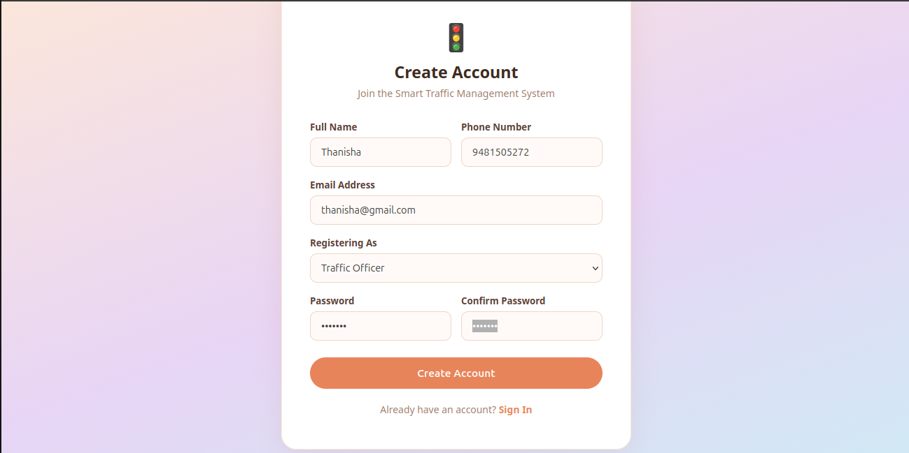
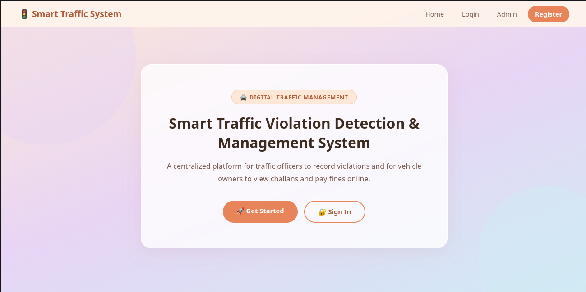
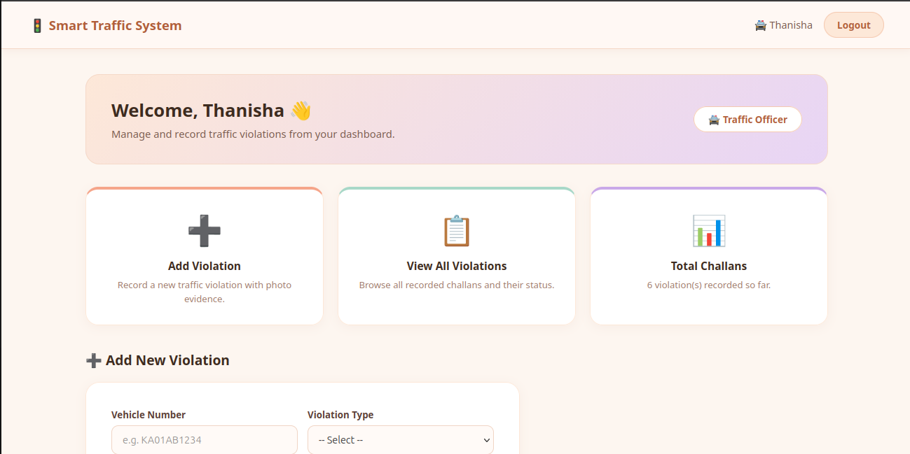
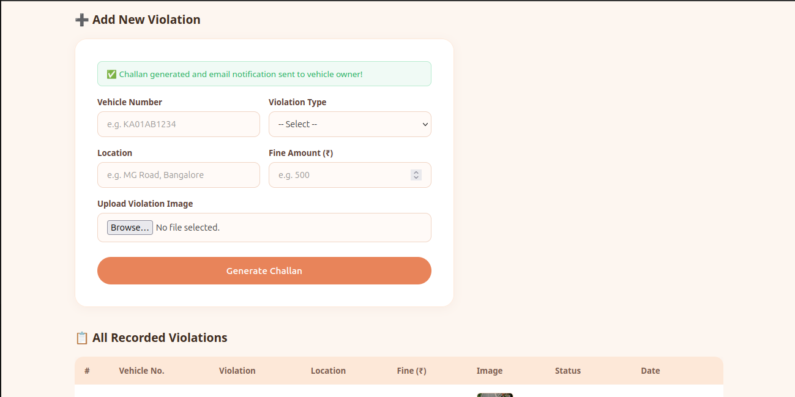
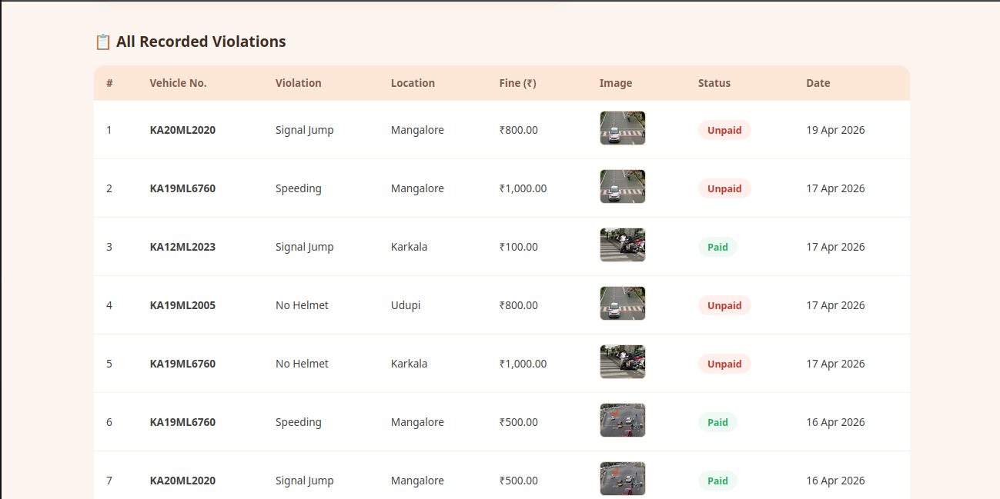

🚦 Traffic Violation Detection & e-Challan System

Overview
This project is a web-based system designed to detect traffic violations and automatically generate challans. Traffic authorities can upload violation images, and the system assigns fines to the registered vehicle owner. Users can log in to view and pay fines online.

---

 Objectives
- Automate challan generation
- Reduce manual errors
- Provide transparency in fine management

---

Tech Stack
- PHP
- MySQL
- HTML, CSS, JavaScript

---

Modules
- Admin (Traffic Police)
- User (Vehicle Owner)
- Violation Processing System

---

Features
- Upload traffic violation images
- Automatic challan generation
- Admin dashboard for traffic officers
- User registration & login
- View violation history
- Online fine payment

---

Setup Instructions
1. Clone the repository  
2. Start XAMPP (Apache & MySQL)  
3. Import `database.sql` into phpMyAdmin  
4. Configure database in `db_connect.php`  
5. Run the project in browser:

http://localhost/Traffic-Violation-System

---

Screenshots

 Login Page

 Registration Page

Dashboard

 Admin Portal

Violation Upload

Violation List

---

Team Members
- Deeksha D S
- Anvitha A V

---

License
This project is licensed under the MIT License.

